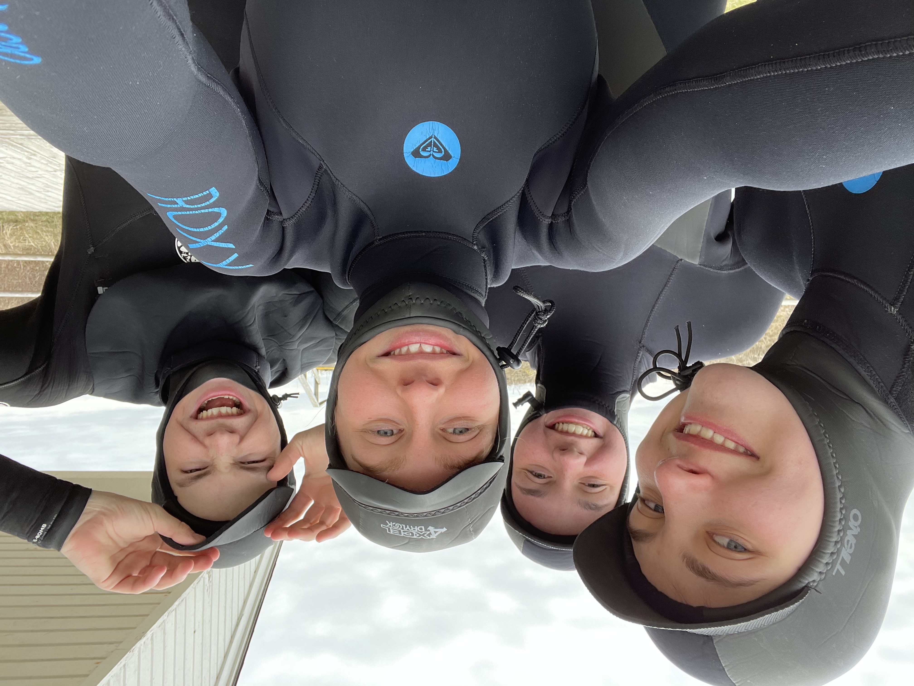

# Alyssa Forbes

Hello and welcome to my portfolio! 

## About me

My name is Alyssa Forbes and I am currently in my third year pursuring a Bachelor of Science degree in neuroscience and statistics. Outisde of the classroom, I work as a research assistant analyzing data in the [PROSIT laboratory](http://prosit.meierlab.info/home-107.html). Aside from coding and analyzing data, I like to take a break from the screen by running, surfing, or painting!

This portfolio will highlight some of my python coding abilities. If you have any questions or comments about any of my work, you can email me at [alyssa.forbes@dal.ca](mailto:alyssa.forbes@dal.ca).

## Some examples of my work

### pandas library

Since embarking on the journey to learn python and become an efficient coder, the [pandas](https://pandasguide.readthedocs.io/en/latest/) package has allowed me to grow comfortable exploring data as a dataframe. Here I use an example of code from an assignment for NESC3505 Fall 2021 to demonstrate how to [read in data using pandas](Assignment3forportfolio.ipynb)

One of the many benefits to the pandas library is that it performs code that is similar to what can be used in other languages such as R, as well as excel. Here is an example of [R code](Rforportfolio.ipynb) that I used when working with data off of our server at work. It essentially does that same thing as in my [previous example](Assignment3forportfolio.ipynb) in that it separates the raw data into columns based on the pipe symbol. 
